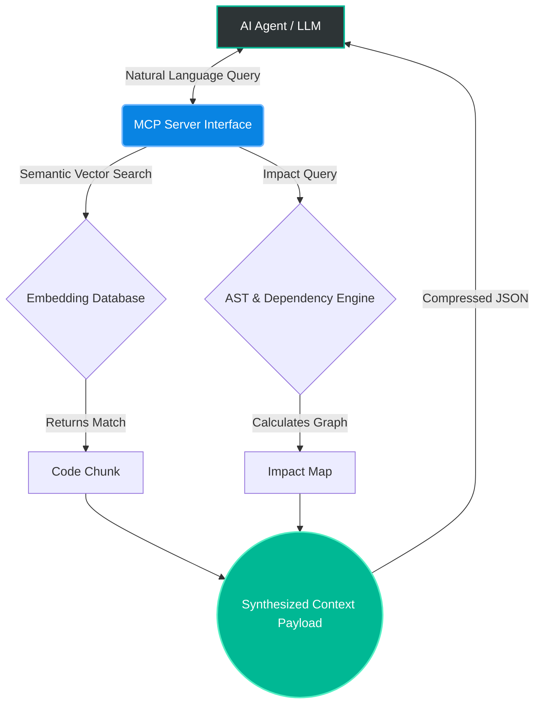
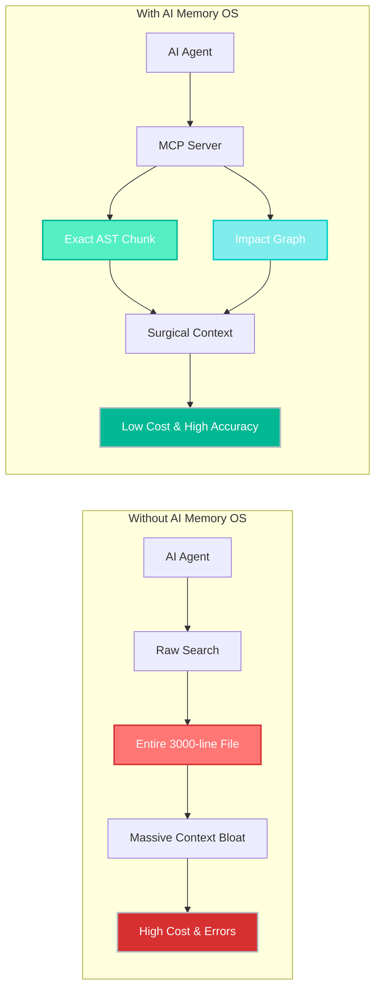

# Stop Piping Raw Code into LLMs: How We Cut Token Costs by 90% with AST & MCP

**Authors:** Nishant Chaudhary & Antigravity (AI Co-Pilot)  
**Domain:** Autonomous AI Agents, Context Optimization, Code Navigation

---

## The TL;DR (Abstract)
If you build apps with AI agents, you know the drill: dump entire files into the prompt, hit the context limit, watch the LLM hallucinate, and pay massive API bills. Traditional text-based RAG and `grep` are fundamentally broken for codebases because they destroy variable scope and ignore dependencies. 

We built **AI Memory OS** to fix this. By parsing code into Abstract Syntax Trees (ASTs), calculating real-time blast-radius impact graphs, and connecting directly to Claude/Gemini via the new Model Context Protocol (MCP), we give AI agents "surgical vision." The result? A **90% reduction in token consumption** per autonomous file edit and zero structural hallucinations.

---

## 1. The Problem: Context Bloat and Hallucinations

When an AI agent (such as Claude or Gemini) is tasked with modifying a massive enterprise codebase, it faces three critical challenges:
1. **The Grep Problem:** Standard string matching returns truncated lines, breaking syntactic boundaries and confusing the LLM.
2. **The LSP Limitation:** Language Server Protocols (LSP) require exact symbol names to function, lacking the semantic understanding required for natural language agentic goals (e.g., *"Find the authentication flow"*).
3. **The Ripple Effect:** Standard RAG pipelines do not map file dependencies. An agent might modify a function without realizing 5 other files rely on its previous signature.

## 2. System Architecture

To solve this, AI Memory OS acts as a middleware OS between the codebase and the LLM. It operates entirely locally to ensure privacy and zero latency.

### 2.1 The Pipeline

## 3. Methodology

### 3.1 Abstract Syntax Tree (AST) Extraction
Instead of splitting files arbitrarily by word count (as seen in traditional RAG), the system parses the code into an AST. When an agent queries a function, the system extracts the **entire node** (function, class, or interface). This ensures the LLM receives code with perfectly preserved scope and syntactic integrity.

### 3.2 The `ai_memory_impact` Algorithm
Before the agent writes code, it calls the impact tool. The engine traverses import/export declarations across the workspace.
- **Inputs:** `TargetFile.js`
- **Outputs:** Array of `DependentFiles[]` and `SuggestedChecks[]`

This effectively grants the agent "foresight" into the blast radius of its intended edits.

## 4. The Workflow: Without vs. With AI Memory OS

### ❌ Without AI Memory OS
- **Blind Navigation:** The AI agent must read entire files (often 2,000+ lines) just to find where a single function lives.
- **Context Bloat:** Pumping 30,000+ tokens of irrelevant code into the LLM context window per request.
- **Hidden Breakages:** The agent edits a function without knowing what other files rely on it, causing silent bugs across the repo.

### ✅ With AI Memory OS (AST + MCP)
- **Surgical Extraction:** The agent queries the MCP conceptually (*"where is the auth middleware?"*) and receives only the exact 50-line AST node.
- **Token Efficiency:** Context window drops to ~2,000 tokens, speeding up response times and cutting API costs by 90%.
- **Impact Graph Pre-computation:** Before editing, the MCP feeds the agent a list of dependent files, ensuring the agent knows the "blast radius" of its code.

| Feature | Standard Workflow | With AI Memory OS |
| :--- | :--- | :--- |
| **Context Feed** | Entire raw files | Intact AST functional blocks |
| **Token Cost/Edit** | ~25,000+ Tokens | ~2,000 Tokens |
| **Dependency Checks** | None (Hallucinations) | Pre-calculated Impact Graphs |

### Visual Comparison

## 5. Token Efficiency Results

In an empirical test conducting a refactor of a Role-Based Access Control (RBAC) middleware in an Express.js application:

- **Baseline (Full Context Load):** ~25,000 Input Tokens
- **AI Memory OS (Targeted AST Load):** ~2,000 Input Tokens
- **Net Reduction:** **~92% Token Savings**

This compression not only reduces API costs but dramatically lowers latency and prevents context-overflow hallucinations.

## 6. Conclusion
Piping raw code into language models is an inefficient paradigm for agentic coding. By introducing a localized, AST-aware memory layer connected via the standard Model Context Protocol, AI agents can navigate repositories with the surgical precision of a senior engineer. AI Memory OS proves that structured context is superior to infinite context. 

---
*Open Source Implementation available on GitHub.*
